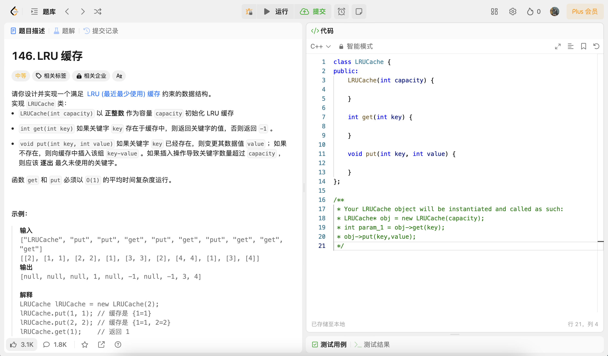

# LRU Cache

## 什么时候会用到缓存(Cache)

**缓存（Cache）通常用于两个速度不同的介质之间，以提高数据访问的速度和效率。这里有几个典型的应用场景：**

**处理器和内存之间：** 处理器（CPU）的运算速度远快于从内存中读取数据的速度。因此，在CPU和内存之间会有多级缓存（L1、L2、甚至L3缓存），用来临时存储即将被CPU使用的数据和指令。这样做可以大幅减少CPU等待数据的时间，提高整体计算效率。

**内存和硬盘之间：** 内存的访问速度也远快于硬盘（无论是HDD还是SSD）。操作系统会使用一部分内存作为硬盘缓存（有时称为“磁盘缓存”或“缓冲区缓存”），用于临时存储最近访问过的数据和文件。当再次请求这些数据时，可以直接从内存中获得，而不是从较慢的硬盘中读取。

**数据库系统中：** 数据库管理系统（DBMS）也会使用缓存技术来提高查询速度和数据处理效率。缓存可以存储经常访问的查询结果、数据库索引等信息，从而加速后续相同或相似查询的处理速度。

**网络请求：** 在网络请求中，缓存也是提高数据访问速度的重要技术。例如，Web浏览器会缓存访问过的网页资源（如HTML文件、图片等），当再次访问这些资源时，可以直接从本地缓存读取，而不需要重新从网络下载。

缓存的关键在于它能够存储一份数据副本，在访问速度较慢的介质之前提供快速访问路径。这样，即使背后的存储介质响应较慢，系统性能也不会受到太大影响。然而，缓存管理（如缓存更新、缓存失效策略等）是实现高效缓存系统的一个挑战。正确和高效地使用缓存可以显著提高系统性能，减少数据处理和响应时间。

## 缓存满了，怎么办？

缓存空间满了之后，更新数据，我要进去，谁出去呢？

## 什么是LRUCache

> LRU是Least Recently Used的缩写，意思是最近最少使用，它是一种Cache替换算法。 什么是Cache？狭义的Cache指的是位于CPU和主存间的快速RAM， 通常它不像系统主存那样使用 DRAM技术，而使用昂贵但较快速的SRAM技术。 广义上的Cache指的是位于速度相差较大的两种 硬件之间， 用于协调两者数据传输速度差异的结构。除了CPU与主存之间有Cache， 内存与硬盘 之间也有Cache，乃至在硬盘与网络之间也有某种意义上的Cache── 称为Internet临时文件夹或 网络内容缓存等。

Cache的容量有限，因此当Cache的容量用完后，而又有新的内容需要添加进来时， 就需要挑选并舍弃原有的部分内容，从而腾出空间来放新内容。**LRUCache 的替换原则就是将最近最少使用的内容替换掉。** 其实，LRU译成最久未使用会更形象， 因为该算法每次替换掉的就是一段时间内最久没有使用过的内容。

## LRUCache的实现

**要设计一个LRUCache不难，要设计一个高效的LRUCache有难度，即：任意操作都是O(1)。**

使用双向链表和哈希表的搭配是最高效和经典的。使用双向链表是因为双向链表可以实现任意位置0(1)的插入和删除，使用哈希表是因为哈希表的增删查改也是O(1)。


## LRUCache对应的OJ题实现

我们借助一个oj题来讲解。

- **[146. LRU 缓存](https://leetcode.cn/problems/lru-cache/description/)**



```cpp
class LRUCache {
public:
    LRUCache(int capacity) {

    }
    
    int get(int key) {

    }
    
    void put(int key, int value) {

    }
};

/**
 * Your LRUCache object will be instantiated and called as such:
 * LRUCache* obj = new LRUCache(capacity);
 * int param_1 = obj->get(key);
 * obj->put(key,value);
 */
```

**首先用一个哈希表，可以保证我们查找是O(1)，那么如何保证LRU？**

**我们可以用一个链表，我们认为尾巴是最不常用的，如果数据被用了，就弄到头上去，所以尾巴就一定是要被淘汰的数据。**

```cpp
std::unordered_map<int, int> __hash_map;
std::list<std::pair<int, int>> __lru_list;
```

此时这种设计：
1. get是O(1)
2. 新增是O(1)
3. 但是更新是O(n)

为什么？因为我们要更新数据，就要找到这个数据，就要遍历链表。

那怎么办？

哈希表里面存链表节点的指针就行了。

```cpp
std::unordered_map<int, std::list<std::pair<int, int>>::iterator> __hash_map;
std::list<std::pair<int, int>> __lru_list;
```

题目的实现如下：

```cpp
#include <unordered_map>
#include <list>
#include <utility>

class LRUCache
{
private:
    std::unordered_map<int, std::list<std::pair<int, int>>::iterator> __hash_map;
    std::list<std::pair<int, int>> __lru_list;
    size_t __capacity;

public:
    LRUCache(int capacity)
        : __capacity(capacity) {}
    int get(int key)
    {
        auto res = __hash_map.find(key);
        if (res == __hash_map.end())
            return -1;
        // 更新链表节点位置
        auto it = res->second;
        /*
            方法一: erase + push_front
                注意记得erase之后更新迭代器，防止迭代器失效
            方法二：转移节点的接口，stl::list提供了
        */
        __lru_list.splice(__lru_list.begin(), __lru_list, it);
        return it->second;
    }

    void put(int key, int value)
    {
        // 1. 新增 2. 更新
        auto res = __hash_map.find(key);
        if (res == __hash_map.end())
        {
            // 新增，如果满了，先删除数据
            /*
                这里用哈希表求size比较细节，这里一定是O(1)
                但是list有些版本下入过没有维护size这个字段，求一次size()就是O(n)了
            */
            if (__capacity == __hash_map.size())
            {
                std::pair<int, int> back = __lru_list.back();
                __hash_map.erase(back.first);
                __lru_list.pop_back();
            }
            // 加入数据
            __lru_list.push_front(std::make_pair(key, value));
            __hash_map[key] = __lru_list.begin();
        }
        else
        {
            // 更新
            auto it = res->second;
            it->second = value; // 更新
            __lru_list.splice(__lru_list.begin(), __lru_list, it);
        }
    }
};
```

同时我也实现了一个stl模式的类模版，实现也非常简单，也欢迎大家补充。

```cpp

#include <unordered_map>
#include <list>
#include <utility>

template <class key_type, class value_type, size_t CAPACITY = 10>
class LRUCache
{
private:
    std::unordered_map<key_type, typename std::list<std::pair<key_type, value_type>>::iterator> __hash_map;
    std::list<std::pair<key_type, value_type>> __lru_list;
    size_t __capacity = CAPACITY;

public:
    LRUCache() {}
    value_type get(key_type key)
    {
        auto res = __hash_map.find(key);
        if (res == __hash_map.end())
            return -1;
        // 更新链表节点位置
        auto it = res->second;
        __lru_list.splice(__lru_list.begin(), __lru_list, it);
        return it->second;
    }
    void put(key_type key, value_type value)
    {
        // 1. 新增 2. 更新
        auto res = __hash_map.find(key);
        if (res == __hash_map.end())
        {
            if (__capacity == __hash_map.size())
            {
                auto back = __lru_list.back();
                __hash_map.erase(back.first);
                __lru_list.pop_back();
            }
            // 加入数据
            __lru_list.push_front(std::make_pair(key, value));
            __hash_map[key] = __lru_list.begin();
        }
        else
        {
            // 更新
            auto it = res->second;
            it->second = value; // 更新
            __lru_list.splice(__lru_list.begin(), __lru_list, it);
        }
    }

public:
    void clear()
    {
        __hash_map.clear();
        __lru_list.clear();
    }
    size_t size() { return __hash_map.size(); }
    bool empty() { return this->size() == 0; }
};
```