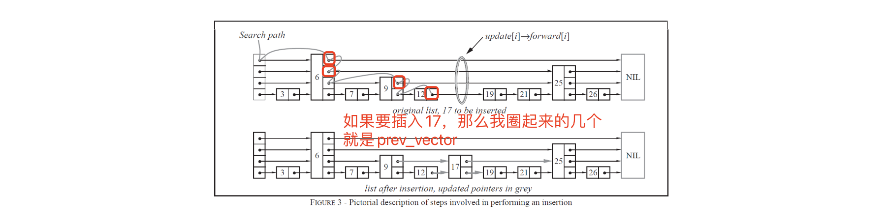

# 跳表 Introduction

## 认识跳表

是一个kv型的查找数据结构。

发明跳表的是William Pugh，论文是[Skip lists: a probabilistic alternative to balanced trees](https://dl.acm.org/doi/abs/10.1145/78973.78977)。

## 实现思路

1. 假如我们每相邻两个节点升高一层，增加一个指针，让指针指向下下个节点，如下图所示。这样所有新增加的指针连成了一个新的链表，但它包含的节点个数只有原来的一半。由 于新增加的指针，我们不再需要与链表中每个节点逐个进行比较了，需要比较的节点数大概 只有原来的一半。
2. 以此类推，我们可以在第二层新产生的链表上，继续为每相邻的两个节点升高一层，增加一个指针，从而产生第三层链表。如下图c，这样搜索效率就进一步提高了。
3. 跳表正是受这种多层链表的想法的启发而设计出来的。实际上，按照上面生成链表的方 式，上面每一层链表的节点个数，是下面一层的节点个数的一半，这样查找过程就非常类似 二分查找，使得查找的时间复杂度可以降低到O(log n)。但是这个结构在插入删除数据的时 候有很大的问题，插入或者删除一个节点之后，就会打乱上下相邻两层链表上节点个数严格 的2:1的对应关系。如果要维持这种对应关系，就必须把新插入的节点后面的所有节点(也 包括新插入的节点)重新进行调整，这会让时间复杂度重新蜕化成O(n)。
4. 跳表的设计为了避免这种问题，做了一个大胆的处理，不再严格要求对应比例关系，而是 插入一个节点的时候随机出一个层数。**这样每次插入和删除都不需要考虑其他节点的层数**， 这样就好处理多了。细节过程入下图:


## skiplist的效率如何保证?

上面我们说到，skiplist插入一个节点时随机出一个层数，听起来怎么这么随意，如何保证搜索时的效率呢？

这里首先要细节分析的是这个随机层数是怎么来的。一般跳表会设计一个最大层数maxLevel的限制，其次会设置一个多增加一层的概率p。那么计算这个随机层数的伪代码如下：

```
randomLevel()
	|v| := 1
	-- random() that returns a random value in [0,1)
	while random() < p and |v| < MaxLevel do
		|v| := |v| + 1
	return |v|
```

根据前面`randomLevel()`的伪码，我们很容易看出，产生越高的节点层数，概率越低。定量的分析如下可以算出定量的式子。

因此，一个节点的平均层数(也即包含的平均指针数目)，计算如下：

$$
1 \times(1-p)+2 p(1-p)+3 p^{2}(1-p)+4 p^{3}(1-p)+\ldots=(1-p) \sum_{k=1}^{+\infty} k p^{k-1}=(1-p) \cdot \frac{1}{(1-p)^{2}}=\frac{1}{1-p}
$$

在Redis的跳表实现中，这两个参数的取值如下。(Redis是nosql数据库，不是常规关系型的，而是kv类型的数据库，一般用来做缓存)

```bash
p = 1/4
maxLevel = 32
```

跳表的平均时间复杂度为O(logN)，这个推导的过程较为复杂，需要有一定的数学功底。

- 可以直接去看论文：ftp://ftp.cs.umd.edu/pub/skipLists/skiplists.pdf
- 也可以看大佬的文章：http://zhangtielei.com/posts/blog-redis-skiplist.html

## 跳表对应的leetcode题目

**leetcode题目链接🔗：**

- **[设计跳表](https://leetcode.cn/problems/design-skiplist/description/)**

### 一些代码中的tips

**`prev_vector`中的解释。**



## 对比平衡树（avl和红黑树）和哈希表

跳表相比平衡搜索树(AVL树和红黑树)对比，都可以做到遍历数据有序，时间复杂度也差不多。

跳表的优势是：

1. 跳表实现简单，容易控制。平衡树增删查改遍历都更复杂。
2. 跳表的额外空间消耗更低。平衡树节点存储每个值有三叉链，平衡因子/颜色等消耗。跳表中p=1/2时，每个节点所包含的平均指针数目为2；跳表中p=1/4时，每个节点所包 含的平均指针数目为1.33。

跳表相比哈希表而言，就没有那么大的优势了。相比而言

1. 哈希表冲突不严重的时候，哈希表平均时间复杂度是O(1)，比跳表快。
2. 哈希表空间消耗略多一点。
3. 但跳表遍历数据有序
4. 跳表空间消耗略小一点，哈希表存在链接指针和表空间消耗。
5. 哈希表扩容有性能损耗
6. 哈希表再极端场景下哈希冲突高，效率下降厉害，需要红黑树补足接力。