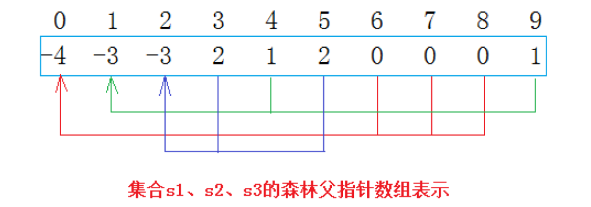

# 并查集

## 并查集的表示

1. 像堆类似，用下标表示关系
2. 双亲表示法

一开始数组存的是-1，表示每个数都是一棵树，每个数表示一个集合

假设数组：
```cpp
int a = [-1,-1,-1,-1,-1];
```
这个数组进行一次合并之后变成：
```cpp
int a = [-1,0,-1,-1,-1];
```
这个表示下标为1的数的父亲就是下标为0的数

如果下标为负数，那么这个数就是树的根



## 并查集实现：

```cpp
template <class T>
class union_find_disjoint_set
{
private:
    std::vector<T> __ufs; // 通过编号找人
public:
    union_find_disjoint_set(size_t n)
        : __ufs(n, -1) {} // 先初始化成-1
    void Union(int x1, int x2)
    {
        int root1 = FindRoot(x1);
        int root2 = FindRoot(x2);
        if (root1 == root2) // 如果在一个集合就没必要合并了
            return;
        if (root1 > root2)
            std::swap(root1, root2); // 统一让下标小的根去合并大的根，其实这个是没有要求的
        __ufs[root1] += __ufs[root2];
        __ufs[root2] = root1;
    }
    int FindRoot(int x)
    {
        int root = x;
        while (__ufs[root] >= 0)
            root = __ufs[root];
        return root;
    }
    bool InSet(int x1, int x2) // 判断是否在同一个集合
    {
        return FindRoot(x1) == FindRoot(x2);
    }
    size_t SetSize()
    {
        size_t cnt = 0;
        for (const auto &e : __ufs)
            if (e < 0)
                ++size;
        return size;
    }
};
```

## 合并

找根，只能是根的合并。

谁合并谁没有严格的要求（压缩路径才需要要求，一般性能要求比较高才需要压缩路径）

## 相关力扣题

[547. 省份数量](https://leetcode.cn/problems/number-of-provinces/description/)

用并查集解决这个问题：

```cpp
class Solution {
public:
    int findCircleNum(vector<vector<int>>& isConnected) {
        union_find_disjoint_set<int> ufs(isConnected.size());
        for(size_t i = 0; i<isConnected.size(); i++)
        {
            for(size_t j = 0; j < isConnected[i].size(); j++)
            {
                if(isConnected[i][j] == 1)
                {
                    ufs.Union(i, j);
                }
            }
        }
        // 现在所有城市能合并的已经合并完了
        return ufs.SetSize();
    }
};
```

[990. 等式方程的可满足性](https://leetcode.cn/problems/satisfiability-of-equality-equations/description/)


```cpp
class Solution {
public:
    bool equationsPossible(vector<string>& equations) {
        std::vector<int> ufs(26, -1);
        auto findroot = [&ufs](int x){
            while(ufs[x]>=0)
                x = ufs[x];
            return x;
        };
        // 第一遍，先把相等的值加到一个集合中来
        for(auto& str : equations)
        {
            if(str[1] == '=')
            {
                int root1 = findroot(str[0] - 'a');
                int root2 = findroot(str[3] - 'a');
                if(root1 != root2)
                {
                    ufs[root1] += ufs[root2];
                    ufs[root2] = root1;
                }
            }
        }
        // 第二遍，看看不相等的是否会出现在一个集合中
        for(auto& str : equations)
        {
            if(str[1] == '!')
            {
                int root1 = findroot(str[0] - 'a');
                int root2 = findroot(str[3] - 'a');
                if(root1 == root2)
                {
                    return false;
                }
            }
        }
        return true;
    }
};
```